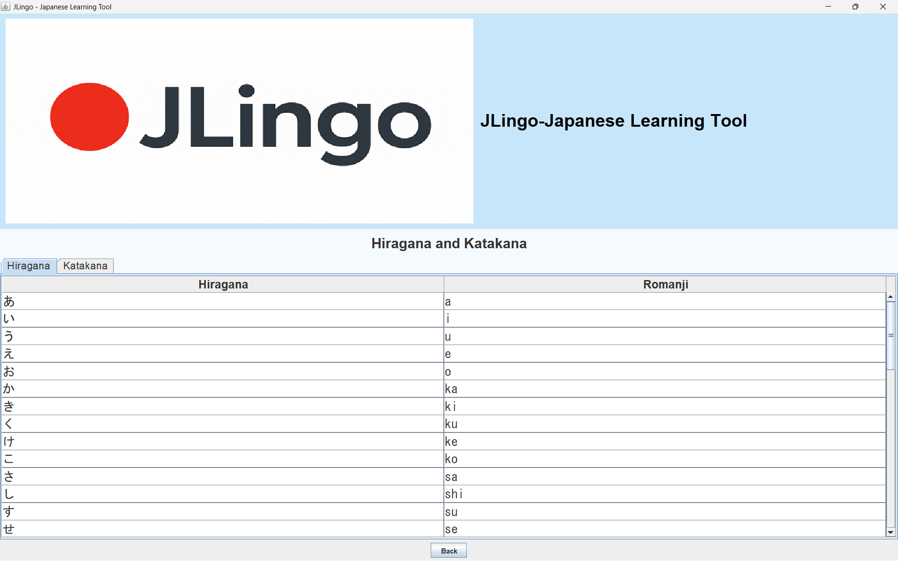
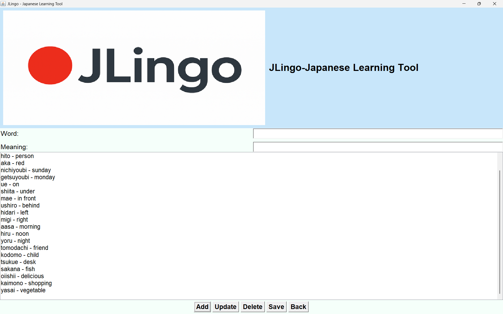

# JLingo ⛩️
> A personal Japanese learning, local-first vocabulary manager tool.

## 🚀 Overview
I am learning Japanese language and I wanted to organize and retain Japanese vocabulary. While studying the language to quickly store, update, and review new words as I encountered them.

This is a 1-tier application designed for local use, focusing on simplicity and effective memorization.

## 🛠️ Tech Stack
* **Language:** Java (JDK 21)
* **IDE:** IntelliJ IDEA
* **Version Control:** Git & GitHub

## 📸 Demo/ Screenshots
**

## ⚙️ How to Run
1. Clone the repo: `git clone https://github.com/aryan-kadamiD/JLingo-japanese-learning-initial`
2. Open the project in IntelliJ IDEA.
3. Run the `JLingo.java` file.

---
Created with ❤️ by [Aryan~]